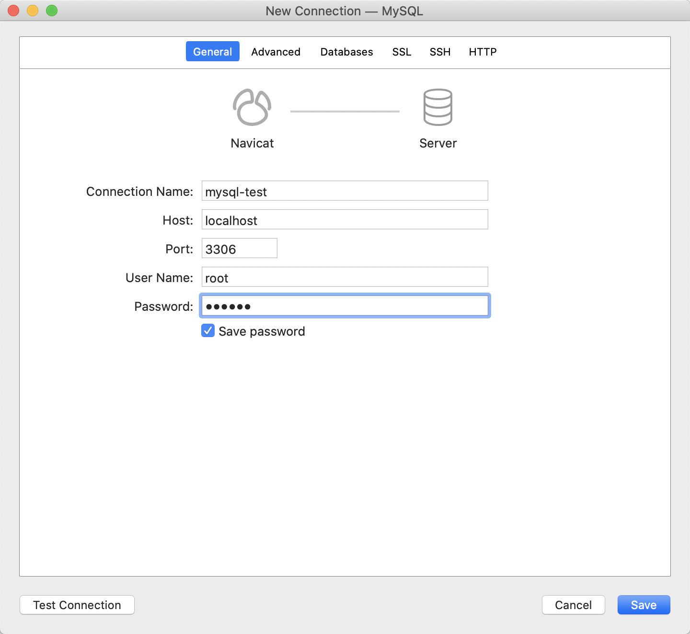

# Mac 使用docker安装连接mysql

## 1. Docker配置

docker search mysql 查看MySQL版本

### 1.1 docker search mysql 查看MySQL版本, 报错

```bash
➜  mall-learning git:(master) ✗ docker search mysql
Error response from daemon: Get https://index.docker.io/v1/search?q=mysql&n=25: EOF
```

[docker search mysql 查看MySQL版本报错解决](./docs/docker01.md)

若docker未替换国内镜像，下载很慢时，可以[替换国内镜像](./docker02.md)：

## 2. 拉取本地镜像

我拉取了5.7版本

```
➜  mall-learning git:(master) ✗ docker pull mysql:5.7
5.7: Pulling from library/mysql
8559a31e96f4: Pull complete
d51ce1c2e575: Pull complete
c2344adc4858: Pull complete
fcf3ceff18fc: Pull complete
16da0c38dc5b: Pull complete
b905d1797e97: Pull complete
4b50d1c6b05c: Pull complete
d85174a87144: Pull complete
a4ad33703fa8: Pull complete
f7a5433ce20d: Pull complete
3dcd2a278b4a: Pull complete
Digest: sha256:32f9d9a069f7a735e28fd44ea944d53c61f990ba71460c5c183e610854ca4854
Status: Downloaded newer image for mysql:5.7
docker.io/library/mysql:5.7
```

### 3. 查看本地镜像

发现5.7版本的mysql已经安装完毕

```
➜  mall-learning git:(master) ✗ docker images
REPOSITORY               TAG                 IMAGE ID            CREATED             SIZE
mysql                    5.7                 9cfcce23593a        8 days ago          448MB
ubuntu                   latest              1d622ef86b13        7 weeks ago         73.9MB
docker/getting-started   latest              3c156928aeec        8 weeks ago         24.8MB
```

### 4. 运行容器

安装完成后，我们可以使用以下命令来运行 mysql 容器：

```
➜  mall-learning git:(master) ✗ docker run -itd --name mysql-test -p 3306:3306 -e MYSQL_ROOT_PASSWORD=123456 mysql:5.7
7e4d41eba184118db36f6bded352093cd3bbf48c42e5c180b58bba8d384d0950
```

参数说明：

- **run**      运行一个容器
- **--name**     后面是这个镜像的名称
- **-p 3306:3306** ：映射容器服务的 3306 端口到宿主机的 3306 端口，外部主机可以直接通过 **宿主机ip:3306** 访问到 MySQL 的服务。
- **-e :** 设置环境变量
- **MYSQL_ROOT_PASSWORD=123456**：设置 MySQL 服务 root 用户的密码。
- **-i:** 以交互模式运行容器，通常与 -t 同时使用；
- **-t:** 为容器重新分配一个伪输入终端，通常与 -i 同时使用；
- **-d:** 表示使用守护进程运行，即服务挂在后台

### 5. 安装成功

```
➜  mall-learning git:(master) ✗ docker ps
CONTAINER ID        IMAGE               COMMAND                  CREATED             STATUS              PORTS                               NAMES
7e4d41eba184        mysql:5.7           "docker-entrypoint.s…"   34 seconds ago      Up 33 seconds       0.0.0.0:3306->3306/tcp, 33060/tcp   mysql-test
```

连接数据库

#### 方式一、命令行客户端连接

```
➜   mysql -h 127.0.0.1 -u root -p
Enter password:
Welcome to the MySQL monitor.  Commands end with ; or \g.
Your MySQL connection id is 3
Server version: 5.7.30 MySQL Community Server (GPL)

Copyright (c) 2000, 2020, Oracle and/or its affiliates. All rights reserved.

Oracle is a registered trademark of Oracle Corporation and/or its
affiliates. Other names may be trademarks of their respective
owners.

Type 'help;' or '\h' for help. Type '\c' to clear the current input statement.

mysql>
```

这里需要尤其注意一下，如果你是Mac，并且用Homebrew方式安装，那么在`-h`的地方不能用`localhost`，而要用`127.0.0.1` 否则会报错

```
➜  mysql mysql -h localhost -u root -p
Enter password:
ERROR 2002 (HY000): Can't connect to local MySQL server through socket '/tmp/mysql.sock' (2)
```

若本地没有命令行客户端，可通过如下命令安装

```
brew install mysql
```

#### 方式二、使用Navicat连接




