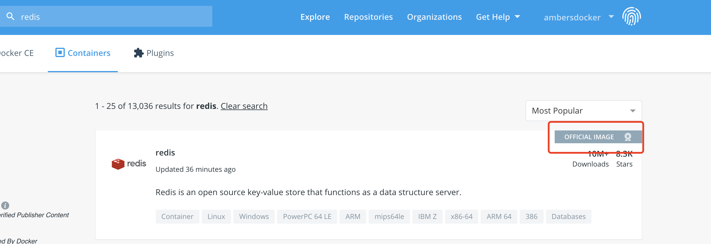
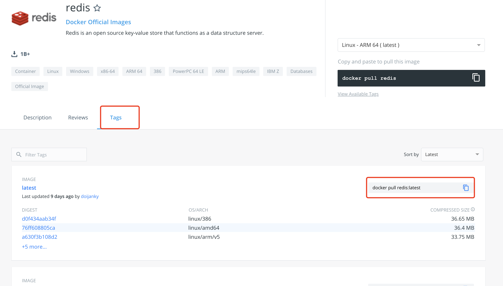

## 使用Docker安装Redis

### 1、下载镜像

在[dockerhub](https://hub.docker.com/) 搜索redis，选中官方的库，可用的版本，选中对应的版本，下载即可

```
docker pull redis:3.2.1
```






### 2、查看本地镜像images

```
➜  mall-tiny-03 git:(master) ✗ docker images
REPOSITORY               TAG                 IMAGE ID            CREATED             SIZE
mysql                    5.7                 9cfcce23593a        9 days ago          448MB
ubuntu                   latest              1d622ef86b13        8 weeks ago         73.9MB
docker/getting-started   latest              3c156928aeec        8 weeks ago         24.8MB
redis                    3.2.1               4465e4bcad80        4 years ago         186MB
```

### 3、启动容器

```
➜  mall-tiny-03 git:(master) ✗ docker run -itd --name redis-test -p 6379:6379 redis:3.2.1
3a459c78d03d655ad54d64e65a826715176d806c34c893f50ab821b5919f029f
```

### 4、查看容器运行情况

```
➜  mall-tiny-03 git:(master) ✗ docker ps
CONTAINER ID        IMAGE               COMMAND                  CREATED             STATUS              PORTS                               NAMES
3a459c78d03d        redis:3.2.1         "docker-entrypoint.s…"   22 seconds ago      Up 21 seconds       0.0.0.0:6379->6379/tcp              redis-test
7e4d41eba184        mysql:5.7           "docker-entrypoint.s…"   43 hours ago        Up 42 hours         0.0.0.0:3306->3306/tcp, 33060/tcp   mysql-test
```

### 5、通过redis-cli测试redis连接

```
➜  mall-tiny-03 git:(master) ✗ docker exec -it redis-test /bin/bash
root@3a459c78d03d:/data# redis-cli
127.0.0.1:6379> set hello spring
OK
127.0.0.1:6379> get hello
"spring"
127.0.0.1:6379>
```

### 6、其他docker操作指定

1、停止容器

```
➜  mall-tiny-03 git:(master) ✗ docker stop redis-test
redis-test
```

2、启动容器

```
➜  mall-tiny-03 git:(master) ✗ docker start redis-test
redis-test
```

3、查看运行中的容器

```
➜  mall-tiny-03 git:(master) ✗ docker ps
CONTAINER ID        IMAGE               COMMAND                  CREATED             STATUS              PORTS                               NAMES
3a459c78d03d        redis:3.2.1         "docker-entrypoint.s…"   3 minutes ago       Up 4 seconds        0.0.0.0:6379->6379/tcp              redis-test
7e4d41eba184        mysql:5.7           "docker-entrypoint.s…"   44 hours ago        Up 42 hours         0.0.0.0:3306->3306/tcp, 33060/tcp   mysql-test
```

4、查看所有容器（包含启动/未启动）

```
➜  mall-tiny-03 git:(master) ✗ docker ps -a
CONTAINER ID        IMAGE                    COMMAND                  CREATED             STATUS                     PORTS                               NAMES
3a459c78d03d        redis:3.2.1              "docker-entrypoint.s…"   3 minutes ago       Exited (0) 8 seconds ago                                       redis-test
7e4d41eba184        mysql:5.7                "docker-entrypoint.s…"   43 hours ago        Up 42 hours                0.0.0.0:3306->3306/tcp, 33060/tcp   mysql-test
903a299f382e        ubuntu                   "/bin/bash"              2 weeks ago         Exited (0) 2 weeks ago                                         amazing_meninsky
c48088744130        docker/getting-started   "nginx -g 'daemon of…"   2 weeks ago         Exited (255) 2 weeks ago   0.0.0.0:80->80/tcp                  infallible_gould
```

